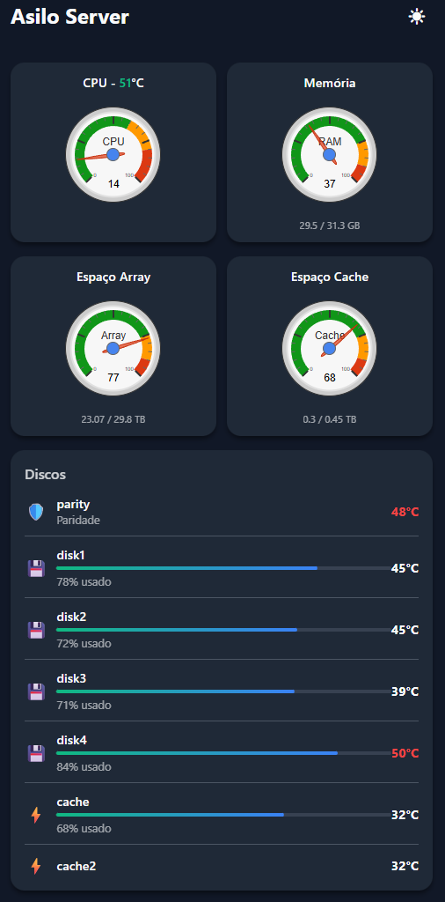

# UNRAID Dashboard Mobile

Painel web simples e responsivo para monitorar seu servidor UNRAID pelo celular, usando a API GraphQL nativa do UNRAID.



## 📱 Recursos

- **Interface Mobile-First**: Design otimizado para visualização em smartphones
- **Autenticação por PIN**: Proteja o acesso com um PIN de 4 dígitos
- **Monitoramento em Tempo Real**:
  - Status de CPU (uso e temperatura)
  - Uso de Memória RAM
  - Temperatura e capacidade de todos os discos (array, parity e cache)
- **Tema Claro/Escuro**: Alterne entre os temas conforme sua preferência
- **Atualização Automática**: Dados atualizados automaticamente no intervalo configurado

## 🛠️ Requisitos

- Servidor web com **PHP 7.4+** e suporte a cURL
- Servidor **UNRAID 7.2+** com API GraphQL habilitada
- Chave de API do UNRAID (gerada nas configurações do servidor)

## 📦 Instalação

### 1. Clone ou baixe este repositório

```bash
git clone https://github.com/seu-usuario/unraidPanel.git
cd unraidPanel
```

### 2. Configure o arquivo de configuração

1. Entre na pasta `server/`:
   ```bash
   cd server
   ```

2. Copie o arquivo de exemplo:
   ```bash
   cp config.example.php config.php
   ```

3. Edite o `config.php` com suas informações:
   - `ACCESS_PIN`: Defina um PIN de 4 dígitos
   - `SERVER_NAME`: Nome que aparecerá no dashboard
   - `UNRAID_HOST`: URL do seu servidor UNRAID (com https://)
   - `UNRAID_API_KEY`: Chave de API gerada no UNRAID
   - `REFRESH_INTERVAL`: Intervalo de atualização em milissegundos

### 3. Como obter a chave de API do UNRAID

1. Acesse seu servidor UNRAID pelo navegador
2. Vá em **Settings** → **API**
3. Clique em **Generate API Key**
4. Copie a chave gerada e cole no `config.php`

### 4. Deploy no servidor web

Copie **todo o conteúdo da pasta `server/`** para o diretório raiz do seu servidor PHP:

```bash
# Exemplo usando SCP
scp -r server/* usuario@seu-servidor:/var/www/html/unraid/

# Ou usando FTP/SFTP
# Copie todo o conteúdo da pasta server/ para o servidor
```

Estrutura final no servidor web:

```
📁 Servidor Web (ex: /var/www/html/unraid/)
├── index.html
├── app.js
├── style.css
├── api.php
├── config.php          ← Criado por você
└── favicon.svg
```

**⚠️ Importante**:
- Copie APENAS o conteúdo da pasta `server/`
- NÃO copie a pasta `server/` em si, apenas seu conteúdo
- O arquivo `config.php` deve estar no mesmo diretório que os outros arquivos

### 5. Acesse pelo navegador

Abra o navegador ou navegador do celular e acesse:
```
http://seu-servidor/unraid/
```

## 📁 Estrutura do Projeto

```
unraidPanel/
├── server/              ← Arquivos para deploy no servidor web
│   ├── index.html
│   ├── app.js
│   ├── style.css
│   ├── api.php
│   ├── favicon.svg
│   ├── config.example.php
│   └── config.php       ← Você cria este arquivo (não commitado)
├── .gitignore
└── README.md
```

## 🔒 Segurança

- O arquivo `config.php` contém informações sensíveis (PIN e chave de API) e **nunca** deve ser commitado no repositório
- O `.gitignore` já está configurado para ignorar este arquivo
- Recomenda-se usar HTTPS para acesso ao painel
- Configure permissões adequadas no servidor web (ex: 644 para arquivos, 755 para diretórios)

## 🎨 Personalização

### Alterar o tema padrão
Edite a linha 107 em `server/app.js`:
```javascript
const savedTheme = localStorage.getItem('theme') || 'dark'; // 'dark' ou 'light'
```

### Ajustar intervalo de atualização
Edite o valor de `REFRESH_INTERVAL` no `server/config.php` (em milissegundos).

## 🐛 Solução de Problemas

### Dashboard não carrega dados
- Verifique se a chave de API está correta
- Confirme se a URL do UNRAID está acessível
- Verifique os logs de erro do PHP

### Erro de SSL/HTTPS
Se usar IP local sem certificado válido, pode ser necessário ajustar as configurações de SSL no `server/api.php` (já configurado por padrão).

### PIN não funciona
- Confirme que o PIN definido em `server/config.php` tem exatamente 4 dígitos
- Limpe o cache do navegador

## 📄 Licença

Este projeto é livre para uso pessoal e comercial.

## 🤝 Contribuições

Contribuições são bem-vindas! Sinta-se à vontade para abrir issues ou pull requests.

## 📧 Contato

Para dúvidas ou sugestões, abra uma issue no repositório.

---

Desenvolvido com ❤️ para facilitar o monitoramento do seu servidor UNRAID
